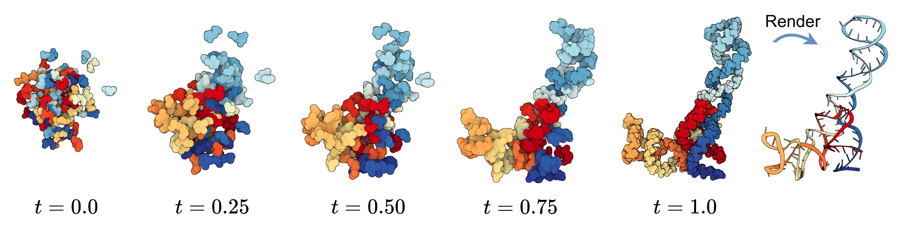
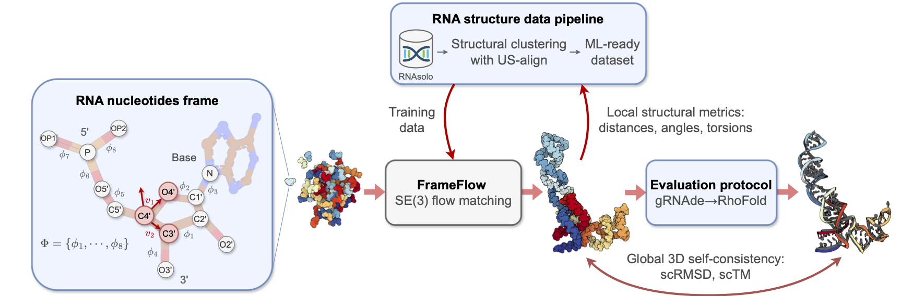
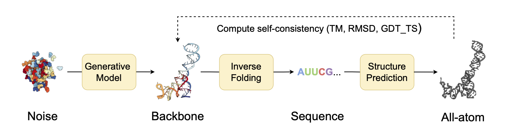

# RNA-FrameFlow: Flow Matching for de novo 3D RNA Backbone Design

## Description

RNA-FrameFlow is a generative model for 3D RNA backbone design based on SE(3) flow matching. 



> Accompanying paper: ['RNA-FrameFlow: Flow Matching for de novo 3D RNA Backbone Design'](https://arxiv.org/abs/2406.13839), by Rishabh Anand*, Chaitanya K. Joshi*, Alex Morehead, Arian Rokkum Jamasb, Charles Harris, Simon V Mathis, Kieran Didi, Bryan Hooi, Pietro Liò.
> - **Oral** at Machine Learning for Computational Biology (MLCB), 2024 (UW, Seattle, Washington)
> - **Oral** at ICML 2024 Structured Probabilistic Inference & Generative Modeling Workshop: [`openreview`](https://openreview.net/forum?id=Z74lflCKmF)
> - **Spotlight** at ICML 2024 AI4Science Workshop: [`openreview`](https://openreview.net/forum?id=YzjHCdZM2h)

## Pipeline



## Contents

- [RNA-FrameFlow: Flow Matching for de novo 3D RNA Backbone Design](#rna-frameflow-flow-matching-for-de-novo-3d-rna-backbone-design)
  - [Description](#description)
  - [Pipeline](#pipeline)
  - [Contents](#contents)
  - [Installation](#installation)
  - [Data Preparation](#data-preparation)
  - [Training and Inference](#training-and-inference)
    - [Download weights](#download-weights)
    - [Using your own retrained checkpoints](#using-your-own-retrained-checkpoints)
    - [Run inference](#run-inference)
    - [Run evaluation](#run-evaluation)
      - [Running `EvalSuite`](#running-evalsuite)
  - [Acknowledgements](#acknowledgements)
  - [Citation](#citation)
  
## Installation

```bash
# clone repository
git clone https://github.com/rish-16/rna-backbone-design.git
cd rna-backbone-design/
# create python environment
conda create -n rna-bb-design python=3.10 -y
conda activate rna-bb-design
# install dependencies
pip install "torch>=2.1.2"
pip install torch_scatter torch_cluster -f https://data.pyg.org/whl/torch-2.1.2+cu121.html  # n.b., skip if these CUDA versions are not desired
pip install -e .
```

> [!CAUTION]
> Do take note of the compatibility between PyTorch and CUDA versions. We used `pytorch-cuda` v11.8 in the installation script but you should change this depending on your system's NVCC version. You can find the target version using `nvidia-smi` and looking for `CUDA Version`.

## Data Preparation

Download RNASolo (3.48GB) containing the ~14K structures used to train our model at a resolution $\leq 4.0$ in the `.pdb` file format. In the project `rna-backbone-design` repository,

```bash
# Download structures in PDB format from RNAsolo (31 October 2023 cutoff)
mkdir -p data/rnasolo; cd data/rnasolo
gdown https://drive.google.com/uc?id=10NidhkkJ-rkbqDwBGA_GaXs9enEBJ7iQ
tar -zxvf RNAsolo_31102023.tar.gz
```

<details>
<summary>Older instructions to download RNAsolo (not working – ignore this)</summary>
    
```bash
# create data directory
mkdir -p data/rnasolo; cd data/rnasolo
# download RNAsolo
wget https://rnasolo.cs.put.poznan.pl/media/files/zipped/bunches/pdb/all_member_pdb_4_0__3_326.zip
unzip all_member_pdb_4_0__3_326.zip # unzips all PDB files
mv all_member_pdb_4_0__3_326.zip ../ # moves ZIP archive out of new file directory
```
</details>

We provide a preprocessing script `process_rna_pdb_files.py` that prepares the RNA samples used during training. Again, in the main project directory,
```bash
# from ./
python process_rna_pdb_files.py --pdb_dir data/rnasolo/ --write_dir data/rnasolo_proc/
```

When you visit `data/rnasolo_proc/`, you should see a bunch of subdirectories representing the root of the PDB entry names. Each subdirectory contains pickled versions of the PDB files which capture some important structural descriptors extracted from the atomic records; this is for easier bookkeeping during training. You'll also notice a `rna_metadata.csv` file. Keep track of the filepath to this CSV file – it contains metadata about the pickled RNA files and the relative filepaths to access them during training.

Your directory should now look like this:
```
.
├── rna_backbone_design
│   ├── analysis
│   ├── data
│   ├── experiments
│   ├── models
│   ├── openfold
│   └── tools
├── configs
│   ├── base.yaml
│   └── inference.yaml
├── data
│   ├── rnasolo
│   └── rnasolo_proc
│       └── rna_metadata.csv
└── camera_ready_ckpts/
```

## Training and Inference

> [!IMPORTANT]
> Our training relies on logging with `wandb`. Log in to WandB and make an account. Authorize WandB [here](https://wandb.ai/authorize).

We use 4 RTX3090 40GB GPUs via DDP to train our model for 120K steps, which took ~15 hours. We train on sequences of length between 40 and 150. For more specific experimental details, look at `configs/config.yaml`.

```bash
# run training
python train_se3_flows.py
```

After training, the final saved checkpoint can be found at `ckpt/se3-fm/rna-frameflow/last.ckpt` directory saved locally (not part of this repo); this `ckpt` directory is created automatically by `wandb`. We also store intermediate checkpoints for your reference. You can rename and shift this `last.ckpt` file where necessary to run inference.

Alternatively, you can use our camera-ready baseline checkpoint. The config files necessary can be found inside `camera_ready_ckpts/`.

> We provide a brief description of the different schemes to represent all-atom RNA molecules used throughout the codebase in `rna_backbone_design/DATA_REPR.md`. 

### Download weights

Our strongest baseline model's trained weights are hosted on Google Drive: [link](https://drive.google.com/drive/folders/1umg0hgkBl7zsF_2GdCIKkfsRWbJNEOvp?usp=sharing). Add it into the `camera_ready_ckpts/` subdirectory. If you are on a remote server, there are libraries like [`gdown`](https://github.com/wkentaro/gdown) that help you retrieve this directly from GDrive. You need to pass in the file ID `1AnDMUa6ZnaRQonQje3Sfo1KBSQAsNKXe`:

```bash
# download checkpoints
cd camera_ready_ckpts/
gdown 1AnDMUa6ZnaRQonQje3Sfo1KBSQAsNKXe
```

Your subdirectory should look like this now:

```
.
└── camera_ready_ckpts/
    ├── inference.yaml # for inference/sampling
    ├── rna_frameflow_public_weights.ckpt # for inference / sampling / finetuning
    └── config.yaml # for training
```

### Using your own retrained checkpoints

If you've retrained RNA-FrameFlow from scratch, as mentioned above, your checkpoint can be found at `ckpts/se3-fm/rna-frameflow/last.ckpt`. After renaming and shifting this `last.ckpt` file where necessary, visit `configs/inference.yaml` and change the path in the inference YAML file:

```
inference:
  ckpt_path: configs/<insert_ckpt_name>.ckpt # path to model checkpoint of interest
```

This ensures the correct model checkpoints are used to generate new samples.

### Run inference

By default we sample 50 sequences per length between 40 and 150. Generated all-atom RNA backbones are stored as PDB files in the `inference.output_dir` directory listed in the inference YAML file.

```bash
# run inference
python inference_se3_flows.py
```

Running inference also performs evaluation on the generated samples to compute local and global structural metrics. Inference together with evaluation takes around 2 hours on our hardware. See the subsequent section for setting up and running evaluation separately from inference.

### Run evaluation



We provide an evaluation pipeline called [`EvalSuite`](https://github.com/rish-16/rna-backbone-design/blob/main/rna_backbone_design/analysis/evalsuite.py) that computes local and global structural metrics when pointed at a directory of our model's RNA backbone samples. We use [gRNAde](https://arxiv.org/abs/2305.14749) (Joshi et al., 2023) as our inverse folder and [RhoFold](https://arxiv.org/abs/2207.01586) (Shen et al., 2022) as the structure predictor. First, download the RhoFold checkpoints (we didn't include this because of its size):

```bash
cd rna_backbone_design/tools/rhofold_api/
mkdir checkpoints
cd checkpoints/
wget https://proj.cse.cuhk.edu.hk/aihlab/RhoFold/api/download?filename=RhoFold_pretrained.pt -O RhoFold_pretrained.pt
```

If the above URL does not work, we have stored the RhoFold checkpoints in a Google Drive for easier access:

> [https://drive.google.com/drive/folders/1umg0hgkBl7zsF_2GdCIKkfsRWbJNEOvp?usp=drive_link](https://drive.google.com/drive/folders/1umg0hgkBl7zsF_2GdCIKkfsRWbJNEOvp?usp=drive_link)

#### Running `EvalSuite`

Go back to the project's root directory. Here is a minimal example of `EvalSuite` in action. The API takes care of the computation, storage, and management of local structural measurements as well as global metrics (desigability, diversity, and novelty). Set-up instructions can be found in `inference_se3_flows.py`.

```python
from rna_backbone_design.analysis.evalsuite import EvalSuite

rna_bb_samples_dir = "generated_rna_bb_samples/" # generated samples for each sequence length
saving_dir = "rna_eval_metrics" # save temp files and metrics

evalsuite = EvalSuite(
              save_dir=saving_dir,
              paths=cfg.inference.evalsuite.paths,
              constants=cfg.inference.evalsuite.constants,
              gpu_id1=0, # cuda:0 -> for inverse-folding model
              gpu_id2=1,  # cuda:1 -> for forward-folding model
            )

# compute local structural measurements and 
metric_dict = evalsuite.perform_eval(
                            rna_bb_samples_dir,
                            flatten_dir=True
                        )

evalsuite.print_metrics(metric_dict) # print eval metrics
"""
Diversity (#clusters / #designable): 0.55
Novelty (pdbTM): 0.63
Designability (% scTM >= 0.45) 0.457
Designability (% scRMSD <= 4 ang): 0.433
"""
```

## Acknowledgements

This work is presented by Rishabh Anand to fulfill the Bachelor's Dissertation requirements at the Department of Computer Science, School of Computing, National University of Singapore (NUS). It is done in collaboration with Pietro Liò's group at the University of Cambridge, UK.

Our codebase builds on the open-source contributions from the following projects:
- [`protein-frame-flow`](https://github.com/microsoft/protein-frame-flow)
- [`se3_diffusion`](https://github.com/jasonkyuyim/se3_diffusion)
- [`MMDiff`](https://github.com/Profluent-Internships/MMDiff)
- [`geometric-rna-design`](https://github.com/chaitjo/geometric-rna-design)

## Citation

```
@article{anand2024rnaframeflow,
  title={RNA-FrameFlow: Flow Matching for de novo 3D RNA Backbone Design},
  author={Anand, Rishabh and Joshi, Chaitanya K. and Morehead, Alex and Jamasb, Arian R. and Harris, Charles and Mathis, Simon and Didi, Kieran and Hooi, Bryan and Li{\`o}, Pietro},
  journal={arXiv preprint arXiv:2406.13839},
  year={2024},
}
```
